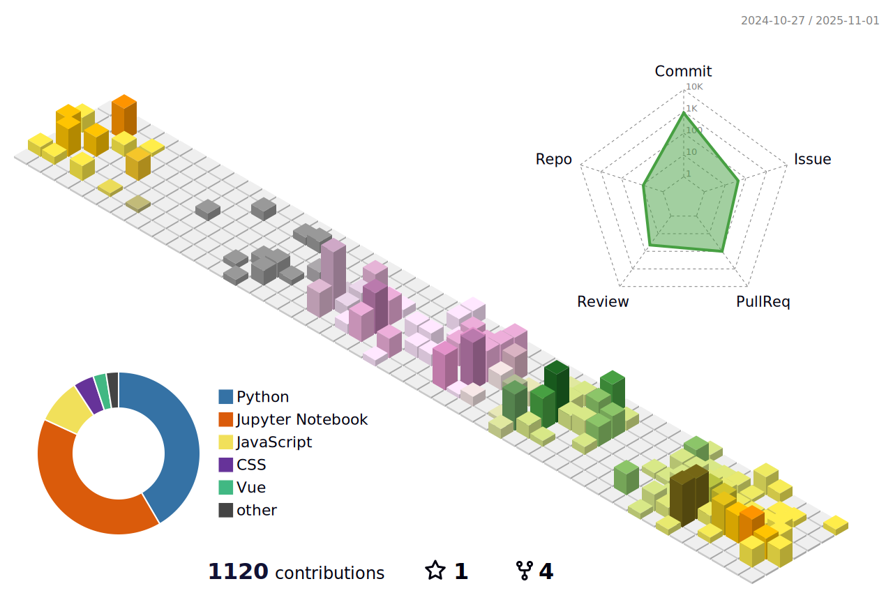

# Welcome

Hello ```np.random.random()``` stranger! Welcome to my github page.



# About me
I am a researcher with interest in computing, HPC, material science, condensed matter physics, and quantum computing, not necessarily in order I just wrote them :laughing: .

# Short Biography

I come from a city of Allahabad, in the state of Uttar Pradesh in India, where I got most of my education. I did my B.Sc. from [University of Allahabad](https://www.allduniv.ac.in/), India with Physics and Mathematics as major in 2005. Then I joined the Integrated Ph.D. (M.Sc. + Ph.D.) program at [Harish-Chandra Research Institute (HRI), Allahabad](https://www.hri.res.in/), India. I finished my MSc in Physics from HRI in 2008, and PhD in Condensed Matter Physics in 2013.

During my Ph.D. I worked on models of electronic correlations
such as Hubbard model, Double-exchange models using real-space based techniques. Large part of my thesis was about the role and impact of geometrical frustration on correlated systems.

After submitting my thesis, I joined [Prof. Stefano Sanvito](https://www.spincomp.com/)’s research group at School of Physics, Trinity College Dublin in 2013. For a year I was Research Assistant, and after defending my thesis in September 2014, I continued there as post-doctoral researcher, and later as Research Fellow and worked over a range of project that overlap material science, many-body theory, high-througput DFT and machine learning.

In February 2023, I joined Irish Centre for High End Computing (ICHEC) as Senior Computational Scientist, to work and contribute in ICHEC's Quantum Programming Initiative.

# Repositories

The repositories listed in my profile are mostly collection of codes I wrote during my career as researcher for various reasons. There are some forked/imported ones from public, which I meant to look at and contribute, but sadly I haven't.

My own code (some day) will be slowly organized to be usable or atleast informative to others as well. Let's see how it evolves. Given that you have visited this page, and are reading up to this point :joy:, be kind enough to drop a few comments on the content, or send me your feedback :pencil: ! Thank you ! :sunglasses: 

Below are some of the interesting repositories.
---


